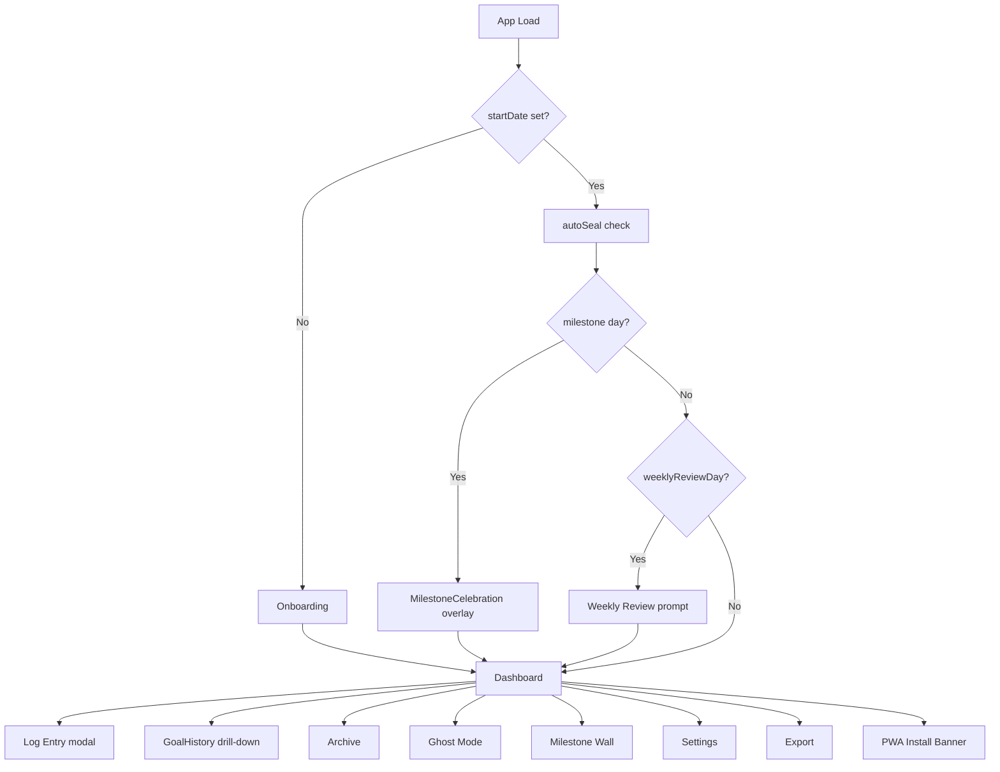
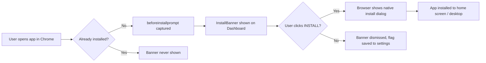

# Project 1127 — Implementation Plan

## Overview
A 1,127-day commitment tracker with terminal-grade aesthetics, zero-skip enforcement, milestone architecture, and deep analytics. Delivered as a **Progressive Web App (PWA)** — installable on Android and desktop from the browser, works fully offline, no app store required.

---

## Tech Stack

| Layer | Choice | Reason |
|---|---|---|
| Framework | React 18 + TypeScript (Vite) | Component model suits multi-view app |
| PWA | `vite-plugin-pwa` + Workbox | Service worker, offline cache, installability |
| Styling | Tailwind CSS + CSS variables | Utility-first, easy theming |
| State | Zustand | Lightweight, no boilerplate |
| Persistence | IndexedDB via `idb` library | Handles large datasets; works fully offline |
| Routing | React Router v6 | Multi-page navigation |
| Charts | Custom SVG + `recharts` | Heatmaps need custom; sparklines via recharts |
| Confetti | `canvas-confetti` | Lightweight milestone celebration |
| PDF Export | `jsPDF` + `html2canvas` | Renders styled components to PDF |
| CSV Export | Native JS Blob API | No lib needed |
| Fonts | Google Fonts: `Share Tech Mono` + `Orbitron` | Cached for offline use via service worker |

---

## PWA Configuration

### Why PWA?
- **Free** — no developer account, no app store submission
- **Cross-platform** — installs on Android (Chrome "Add to Home Screen") and Desktop (Chrome/Edge "Install App")
- **Offline-first** — all data in IndexedDB; app shell cached by service worker
- **App-like** — fullscreen mode, no browser chrome, standalone window on desktop

### `vite.config.ts` PWA setup
```typescript
import { VitePWA } from 'vite-plugin-pwa';

VitePWA({
  registerType: 'autoUpdate',
  includeAssets: ['favicon.ico', 'icon-192.png', 'icon-512.png'],
  manifest: {
    name: 'Project 1127',
    short_name: 'P-1127',
    description: '1,127-day commitment tracker',
    theme_color: '#000000',
    background_color: '#000000',
    display: 'standalone',        // ← hides browser chrome, feels native
    orientation: 'portrait',
    start_url: '/',
    icons: [
      { src: 'icon-192.png', sizes: '192x192', type: 'image/png' },
      { src: 'icon-512.png', sizes: '512x512', type: 'image/png' },
      { src: 'icon-512.png', sizes: '512x512', type: 'image/png', purpose: 'maskable' }
    ]
  },
  workbox: {
    globPatterns: ['**/*.{js,css,html,ico,png,woff2}'],
    runtimeCaching: [
      {
        urlPattern: /^https:\/\/fonts\.googleapis\.com\/.*/i,
        handler: 'CacheFirst',
        options: { cacheName: 'google-fonts', expiration: { maxEntries: 10, maxAgeSeconds: 60 * 60 * 24 * 365 } }
      }
    ]
  }
})
```

### Required Assets
- `public/icon-192.png` — app icon 192×192 (cyberpunk green terminal logo)
- `public/icon-512.png` — app icon 512×512
- `public/favicon.ico`
- `public/screenshots/` — optional but improves Android install prompt

### Install Prompt UX
- Add a subtle `InstallBanner` component that appears at the bottom of Dashboard on first visit
- Listens to the `beforeinstallprompt` browser event
- Shows: `"Install Project 1127 as an app"` with `INSTALL` + `DISMISS` buttons
- After install, banner is permanently hidden (stored in settings)

### Hosting
- Deploy to **Vercel** (free tier) or **Netlify** (free tier) — both support PWA with HTTPS out of the box (HTTPS is required for service workers)
- Or serve locally via `vite preview` for personal use

---

## Project Structure

```
src/
  components/
    onboarding/
      ContractScreen.tsx        ← "Sign the Contract" multi-step form
      GoalConfigurator.tsx      ← Define 1–7 goals with priority tags
    dashboard/
      DashboardPage.tsx         ← Main hub
      CountdownHeader.tsx       ← Day X / 1127, progress bar, streak
      GoalCard.tsx              ← Per-goal card with heatmap thumbnail
      DailyReflection.tsx       ← Free-form note + mood input
      MotivationalQuote.tsx     ← Daily rotating quote
      InstallBanner.tsx         ← PWA install prompt banner
    entry/
      EntryModal.tsx            ← Log today's entry (280 char cap, sealed)
      GoalHistory.tsx           ← Full per-goal history drill-down
    weekly/
      WeeklyReviewPage.tsx      ← Weekly reflection prompt
    milestones/
      MilestoneWall.tsx         ← All milestone cards
      MilestoneCard.tsx         ← Summary card per milestone
      MilestoneCelebration.tsx  ← Confetti + animation overlay
    archive/
      ArchivePage.tsx           ← Scrollable full history
      ArchiveDay.tsx            ← Collapsible day entry
      ArchiveFilters.tsx        ← Goal / date / mood / priority filters
    ghost/
      GhostModePage.tsx         ← Analytics dashboard
      ProjectionEngine.tsx      ← Milestone forecast cards
      HeatmapFull.tsx           ← Full journey heatmap per goal
      SparklineRow.tsx          ← 14-day sparklines
      MoodTrendGraph.tsx        ← 30-day mood trend
      StatsPanel.tsx            ← Aggregate statistics
    settings/
      SettingsPage.tsx
    export/
      ExportPage.tsx
    shared/
      Heatmap90.tsx             ← 90-day thumbnail heatmap
      PriorityBadge.tsx
      SealedBadge.tsx
      ProgressBar.tsx
      StreakCounter.tsx
  store/
    useAppStore.ts
    slices/
      goalsSlice.ts
      entriesSlice.ts
      milestonesSlice.ts
      settingsSlice.ts
      reviewsSlice.ts
  lib/
    db.ts                       ← IndexedDB setup via `idb`
    dateUtils.ts
    projectionEngine.ts
    autoSeal.ts
    exportPDF.ts
    exportCSV.ts
    quotes.ts
    installPrompt.ts            ← beforeinstallprompt event handler
  types/
    index.ts
  App.tsx
  main.tsx
  index.css
public/
  icon-192.png
  icon-512.png
  favicon.ico
vite.config.ts                  ← VitePWA plugin configured here
```

---

## Data Models

```typescript
type Priority = 'critical' | 'high' | 'medium' | 'low';
type Mood = 1 | 2 | 3 | 4 | 5;

interface Goal {
  id: string;
  name: string;
  priority: Priority;
  createdAt: string;
  locked: boolean;
}

interface DayEntry {
  id: string;
  goalId: string;
  date: string;            // YYYY-MM-DD
  content: string;         // max 280 chars, "Nothing" if auto-filled
  isAutoFilled: boolean;
  sealed: boolean;
  createdAt: string;
}

interface DailyLog {
  date: string;
  reflection: string;      // max 500 chars
  mood: Mood;
  sealed: boolean;
}

interface WeeklyReview {
  id: string;
  weekStart: string;
  reflection: string;
  totalEntries: number;
  moodAverage: number;
  sealed: boolean;
  createdAt: string;
}

interface MilestoneRecord {
  day: 100 | 250 | 500 | 750 | 1000 | 1127;
  unlockedAt: string;
  completionRate: number;
  totalEntries: number;
  longestStreak: number;
  moodAverage: number;
  goalSnapshots: { goalId: string; name: string; completionRate: number }[];
}

interface AppSettings {
  startDate: string;
  goalCount: number;
  weeklyTarget: number;
  weeklyReviewDay: number;
  notificationsEnabled: boolean;
  installBannerDismissed: boolean;
  theme: 'dark-terminal';
}
```

---

## Screen-by-Screen Plan

### 1. Onboarding — "Sign the Contract"

**Route**: `/onboard`

**Steps**:
1. Welcome screen — full-screen terminal intro: `"You are about to commit 1,127 days."` Single CTA: `SIGN THE CONTRACT`
2. Goal Configurator — 1–7 goals, each with name + priority tag
3. Weekly Target — slider 1–7 days/week
4. Weekly Review Day — day of week picker
5. Confirmation — display all goals + settings → `EXECUTE CONTRACT`

**Lock logic**: `lockedAt` timestamp per goal; after 24 hours `locked = true`.

---

### 2. Dashboard

**Route**: `/`

**Layout**:
- Top bar: `PROJECT 1127 // DAY [X] OF 1,127` + thin green progress bar
- Motivational quote (daily rotation)
- Global streak badge
- Daily reflection text area + mood selector (sealed EOD)
- Goal cards grid (1–7 cards)
- InstallBanner (bottom, dismissible, only shows if not installed)

**GoalCard** contains:
- Goal name + Priority badge
- Today's entry preview or `— not yet logged —`
- Per-goal streak
- Completion rate progress bar
- 90-day heatmap thumbnail
- `LOG TODAY` + `VIEW HISTORY` buttons

---

### 3. Daily Entry System

**EntryModal**: 280-char text area + `SEAL ENTRY` (irreversible).

**Zero-skip** (`autoSeal.ts`): On every app open, scan all goals for all past days. Any missing entry → auto-insert `"Nothing"` sealed entry.

---

### 4. Weekly Review

**Route**: `/weekly-review`

Triggered on app open if today = configured `weeklyReviewDay` and no review exists for this week. Displays week summary → user writes reflection → `SEAL REVIEW`.

---

### 5. Milestone System

**Route**: `/milestones`

Milestones: Day 100, 250, 500, 750, 1000, 1127.

On app open: if `currentDay` hits a milestone and no record exists → generate `MilestoneRecord`, show confetti overlay. Milestone Wall shows all earned cards + greyed-out future milestones.

---

### 6. Archive View

**Route**: `/archive`

Filter bar (goal, date range, mood, priority, keyword search). Reverse-chronological collapsible days. Weekly review blocks appear inline at week boundaries.

---

### 7. Ghost Mode (Analytics)

**Route**: `/ghost`

- Projection cards per milestone
- Per-goal sparklines (14-day)
- Full heatmaps per goal
- Mood trend (30-day line graph)
- Stats panel (total entries, words, streaks, completion rates)
- Adjustable weekly target with real-time recalculation

---

### 8. Settings

**Route**: `/settings`

Goal count, weekly target, review day, notifications, theme, `VOID THE CONTRACT` (triple-confirm full reset).

---

### 9. Export

**Route**: `/export`

- Full Journal PDF
- Per-Goal PDF
- Raw CSV

---

## Theming

```css
:root {
  --bg: #000000;
  --surface: #0a0a0a;
  --border: #1a1a1a;
  --accent: #00ff41;
  --accent-dim: #007a1f;
  --text: #e0e0e0;
  --text-muted: #555555;
  --critical: #ff3131;
  --high: #ff8c00;
  --medium: #ffd700;
  --low: #00bfff;
  --font-mono: 'Share Tech Mono', monospace;
  --font-display: 'Orbitron', sans-serif;
}
```

---

## Key Logic Modules

| Module | Responsibility |
|---|---|
| [`dateUtils.ts`](src/lib/dateUtils.ts) | `getDayNumber`, `getStreakLength`, `getDaysRemaining`, `getWeekStart` |
| [`projectionEngine.ts`](src/lib/projectionEngine.ts) | Milestone pace forecasting |
| [`autoSeal.ts`](src/lib/autoSeal.ts) | Zero-skip "Nothing" enforcement on app mount |
| [`exportPDF.ts`](src/lib/exportPDF.ts) | jsPDF + html2canvas PDF generation |
| [`installPrompt.ts`](src/lib/installPrompt.ts) | Captures and defers `beforeinstallprompt` event for custom UI |

---

## Routing Map

```
/                   → Dashboard (redirects to /onboard if no startDate)
/onboard            → Onboarding
/entry/:goalId      → GoalHistory drill-down
/weekly-review      → Weekly Review
/milestones         → Milestone Wall
/archive            → Archive View
/ghost              → Ghost Mode Analytics
/settings           → Settings
/export             → Export
```

---

## Implementation Order

```
Phase 1 — Foundation
  1. Vite + React + TS scaffold
  2. vite-plugin-pwa setup (manifest, service worker, icons)
  3. Tailwind + CSS variable theme
  4. IndexedDB setup (db.ts)
  5. Zustand store + all slices
  6. React Router setup

Phase 2 — Core Flow
  7. Onboarding (ContractScreen + GoalConfigurator)
  8. Dashboard skeleton + CountdownHeader
  9. GoalCard + EntryModal + DayEntry sealing
 10. DailyReflection + Mood input
 11. autoSeal zero-skip enforcement
 12. InstallBanner (PWA prompt)

Phase 3 — Reviews & Milestones
 13. Weekly Review page + trigger logic
 14. Milestone detection + MilestoneCard
 15. MilestoneCelebration confetti overlay
 16. Milestone Wall

Phase 4 — Archive & Analytics
 17. Archive page + filters + search
 18. Ghost Mode: ProjectionEngine
 19. Ghost Mode: Heatmaps + Sparklines
 20. Ghost Mode: MoodTrend + StatsPanel

Phase 5 — Settings & Export
 21. Settings page
 22. Export: CSV
 23. Export: PDF (full + per-goal)

Phase 6 — Polish + Deploy
 24. Animations (page transitions, card reveals, heatmap fill)
 25. Motivational quotes array
 26. Responsive layout audit (mobile-first for Android)
 27. Deploy to Vercel/Netlify for HTTPS (required for service worker)
 28. Test PWA install on Android Chrome + Desktop Chrome/Edge
```

---

## App Navigation Flow



---

## PWA Install Flow


